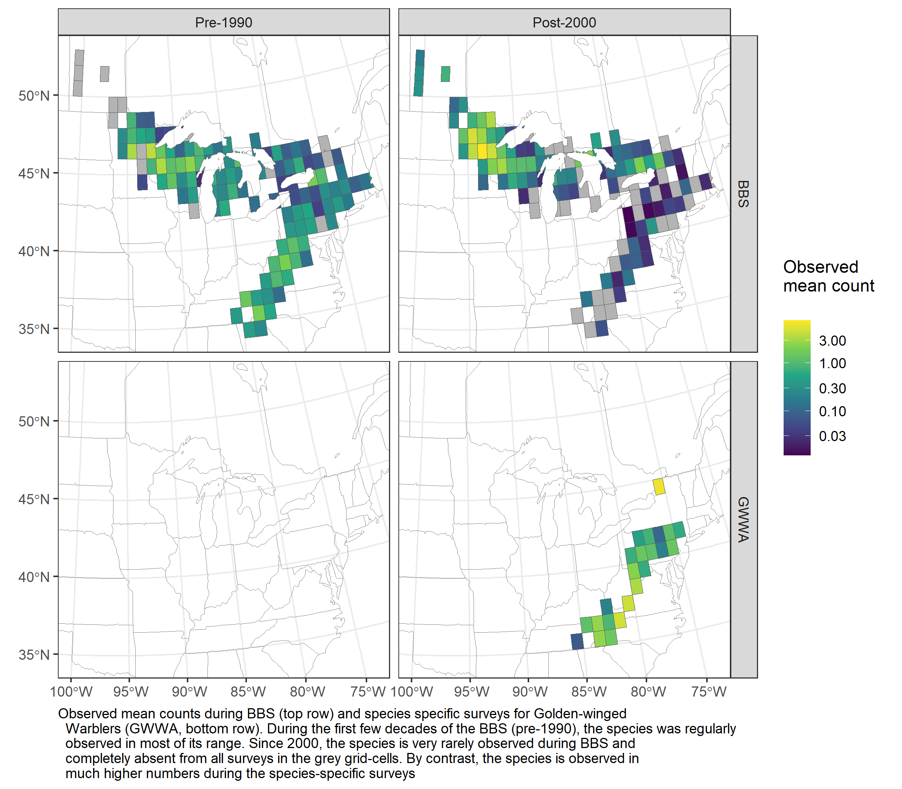
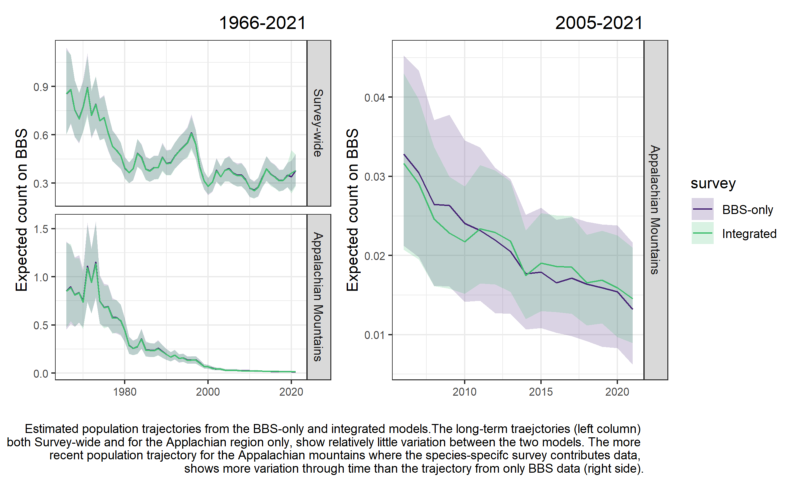
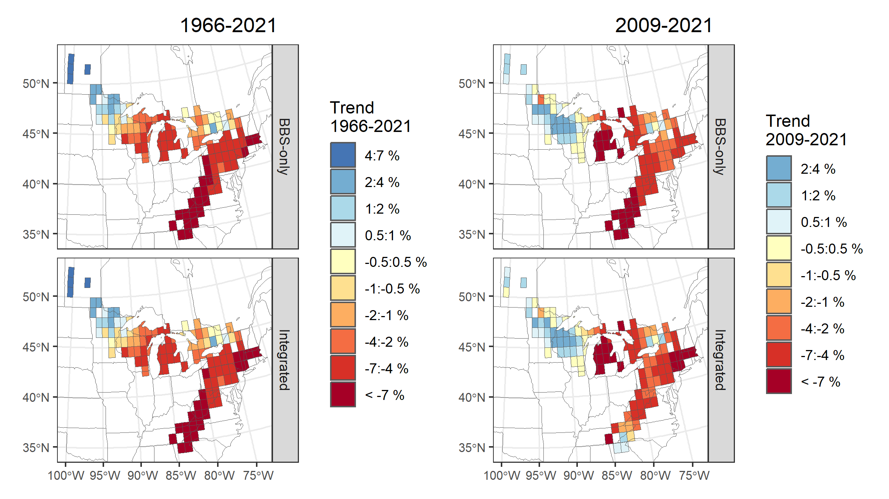
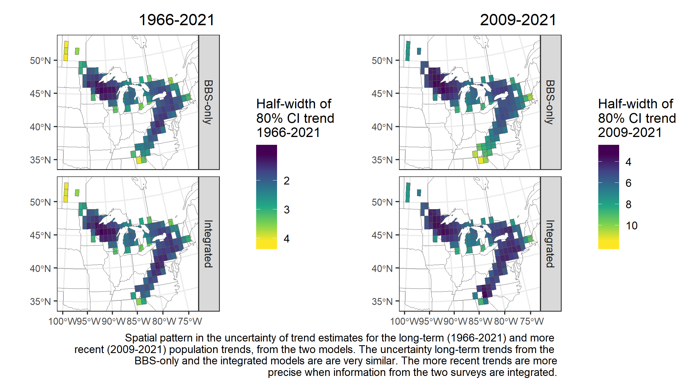

# GWWA_Integrated_trend

## Integrated spatial trend model for BBS and GWWA surveys

Golden-winged warblers populations have changed since 1970, when structured monitoring began with the North American Breeding Bird Survey (BBS). They have experienced particularly severe population declines in the southern part of their breeding range in the Appalachian mountains. In this region, the species has declined to a point where it is very rarely detected during BBS surveys in the last 15-20 years. As a result, there is very little new information coming from the BBS to help understand ongoing population trends in that portion of its range, other than the ongoing series of 0-counts that provide a clear indication the species populations have not recovered to their previous levels. We used an integrated, spatially explicit trend model to leverage both long-term data from the BBS and a more recent targeted species-specific program to generate range-wide and regional trend estimates, including for areas where BBS surveys no longer reliably detect the species. We integrated data from the two programs by sharing information on annual differences in relative abundance across the species range, using a first-difference time-series, that includes an intrinsic conditional autoregressive (iCAR) component to share information on trends in a spatially explicit way.

### The data

We used counts of Golden-winged Warblers in the BBS database from 1970 through 2021 (Ziolkowski et al. 2022). The BBS provides trend information across much of Canada and the United States for up to 500 species of birds (Hudson et al. 2017, Sauer et al. 2017). BBS data are collected annually by expert volunteers conducting 50, 3-minute point-counts along a roughly 40-km long roadside route, and approximately 5000 routes are surveyed each year (Hudson et al. 2017). The field methods are designed to estimate changes in relative abundance through time by controlling for the effects of survey location, weather, time of day, and season, as well as variations among observers (Sauer et al. 2017). In the Appalachian portion of their range, one or more Golden-winged Warblers were observed during an average BBS count prior to the 1990s (top-left facet of Figure 1). Since the 1990s, the species has observed very rarely (one observation in every 10 - 100 surveys) or not-at-all in some regions (grey strata in the top-right facet of Figure 1).

We also used counts of Golden-winged Warblers from another structured, citizen-science monitoring program that was established in 2009 to improve information on the species' population trends (Wood et al. 2017). The species-specific program targets suitable habitat and use field protocols designed to increase the probability of detection when the species is present, leading to much higher mean counts of birds observed at a location in each year, and thereby more information to estimate changes over time. This species-specific monitoring program has a spatially balanced sampling design within the Northern Appalachian Mountains Bird Conservation Region (BCR 28). It combines both off-road and roadside surveys at locations within the species' preferred habitat. The protocol uses a highly-structured field survey method that includes passive point-count surveys and call playback to increase the detection probability of the species (Wood et al. 2017) while strictly controlling effort and detectabilty. The point count locations are stratified into spatial regions defined by one-quarter Delorme Atlas squares (quads), and each quad includes five point count locations. Inferences on trend are based on changes in abundance or occupancy in each of the quads. As such, these replicate point count locations within quads represent a comparable structure to the replicate stops within BBS routes. To match the way replicate stops are handled in the BBS, we have summed the observed counts of birds by a given observer across all count locations in each quad and used an offset term to adjust for any variations in the total number of counts among quads, observers, and years. We also restructured the species-specific program data to match the spatial stratification of the BBS data by joining each quad to the 1-degree grid-cell that contains the centroid of the quad. As a result, information on species trend in a given grid-cell can be informed by changes between subsequent annual surveys on a given route (BBS) or subsequent annual surveys in a given quad (species-specific program).

## The Model

The model is a modification of the spatially explicit first-difference model for the BBS, described in [Smith et al., 2024](https://doi.org/10.1093/ornithapp/duad056). It uses data from the full time-series of the BBS (1966-2021) and the species-specific program (2009-2021) to integrate information on annual changes in the species' population, while accounting for differences between the two programs and variations among observers, survey-sites, and strata. We stratified the data from each program into 1-degree longitude by latitude grid cells.

$$ C_{m,i,t,r,j}=Negative\ Binomial\left(\lambda_{m,i,t,r,j},\phi_m\right) $$

$$
log\left(\lambda_{i,t,r,j}\right)=\alpha_i+\theta_{r,m}+\mu_m+\log(n_{m,i,j,t})+\gamma_{i,t}+\eta Ι_{m,j,t}+\omega_{j,m} 
$$

In the base model, we estimated the observed counts ($C_{m,i,t,r,j}$) of Golden-winged Warblers with program-m (BBS or GWWA), at survey site-r (BBS route or atlas quad), in stratum-i (1-degree grid cell) and year-t, by observer-j as realizations of a negative binomial distribution, with mean $\lambda_{m,i,t,r,j}$ and inverse dispersion parameter $\phi_m$ specific to each program. The log of the mean ($\lambda_{m,i,t,r,j}$) of the negative binomial distribution was modeled as an additive combination of stratum-level intercepts ($\alpha_i$), site-level intercepts for each BBS route or quad ($\theta_{r,m}$), program intercepts ($\mu_m$), year-intercepts ($\gamma_{i,t}$), and observer-intercepts ($\omega_{j,m}$). In addition, the model included an offset to account for the varying number of GWWA point counts the contributed to the summed counts recorded by observer-j in year-t and stratum-i ($\log(n_{m,i,j,t}$, set to zero for all counts from BBS), and a first-year observer-effect ($\eta I_{m,j,t}$ set to zero for all counts from the species-specific program) for BBS observers conducting their first observation on a given route.

The variation among observers, variation among sites (BBS routes and altas quads) and inverse dispersion term of the negative binomial distributions were estimated separately for each of the two programs. We estimated observer intercepts as drawn from zero-mean normal distributions, with standard deviations estimated for each program ($\omega_{j,m} \sim N(0,\sigma_m)$). We estimated site-level intercepts similarly, drawn from zero-mean normal distributions with standard deviations estimated for each survey-method ($\theta_{r,m} \sim N(0,\sigma_m)$).

The year-intercepts ($\gamma_{i,t}$) in this model are spatially explicit estimates of the annual relative abundance in a given stratum and year. They are estimated in a joint-likelihood framework sharing information between the two programs in a given stratum. The year-intercepts are set to zero for the mid-year of the time-series and for other years they are an additive combination of the term from the previous year, plus an estimate of the annual difference from the previous year ($\gamma_{i,t} = \gamma_{i,t-1} + \beta_{i,t}$). This annual difference component $\beta_{i,t}$ is the parameter that is jointly estimated with data from the two surveys. These annual differences are estimated using a hierarchical and spatially explicit model structure. Each annual estimate is itself an additive sum of a hyperprior that represents the mean annual change across all strata in the species range, and a strata-specific component that tracks spatial variation around that range-wide mean. We estimated the hyperpriors ($B_t$) as drawn from a zero-mean normal distribution, following a random-effects first-difference structure that shrinks annual changes towards zero unless the data suggest otherwise. The strata-specific component ($\beta_{i,t}$) was estimated using the iCAR structure described in Smith et al. (2023), so that each stratum-level component was drawn from a normal distribution centered on the mean of the values for the neighbouring strata with some estimated standard deviation ($\sigma_B$).

$$
\beta_{i,t} = B_t + \beta^{\prime}_{i,t}
$$

$$
B_t \sim N(0,\sigma_B)
$$

$$
\beta^{\prime}_{i,t}\sim Normal\left(\frac{\sum_{n{\in N}_i}\beta^{\prime}_{n,t}}{N_i},\frac{\sigma_{\beta^{\prime}}}{N_i}\right)
$$

We estimated annual relative abundance and trends from the model following standard approaches for the BBS data and Smith et al. (2023), using modified versions of the functions in the R-package bbsBayes (Edwards et al. 2021). We scaled all predictions to represent the expected mean count of Golden-winged Warblers on an average BBS route by an average BBS observer, so that predicted population trajectories are consistently defined across all strata and years. That is, they represent the expected counts on BBS after integrating information on the annual population changes from the species-specific monitoring program.

We also fit an otherwise identical model that only included the BBS data. We compared predicted population trajectories and trends for the region and time-period where the species-specific survey was conducted to contrast the signals of population change in the two programs.

## Results

Integrating information from the two programs has little effect on the survey-wide long-term population trends and trajectories, and essentially no effect on the trends and trajectories outside of the region where the species-specific survey contributes information. Trends and trajectories in the Appalachian region since the species-specific survey began (2009) show more variation in space and time.  

In addition, integrating information from the two surveys improves the precision of the trend estimates in the Appalachian regions. 

## Discussion

### Important difference between the surveys and limits to our inference

The two monitoring programs are highly structured surveys designed to track changes over time in populations, while controlling for variations in effort. However, the BBS is designed to track population changes in populations within a broader landscape including those due to changes in suitable habitat, and by contrast, the species-specific survey was designed to track population changes within suitable habitat. However, we do not have an estimate of the changes in suitable habitat since 2009. Therefore in order to draw inferences about the changes in the species regional population, we must assume no change in available habitat. If the amount of suitable habitat has changed, then the estimated trend from the species-specific monitoring program will be biased, relative to changes in the regional population size. If suitable habitat has increased, then our trend will have negative bias (i.e., more negative/less positive than then the true species population trend). By contrast, if suitable habitat has decreased, then our estimated trend will have the opposite bias; we will estimate a more positive/less negative trend than the true overall species trend in the region. Although the trend information derived from the species-specific monitoring program may not reflect the overall regional population change, it still accurately reflects the change in the species abundance within suitable habitat. Importantly, the BBS data on their own show that the species' population in the Appalachian region are strongly dependent on factors acting outside of the region (Kramer et al. 2018). So although more information on the changes in habitat since 2009 would help interpret the trend estimates, habitat loss is not likely the most important factor affecting trends in this region.
