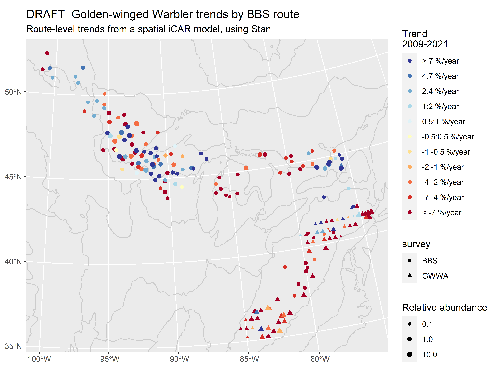

# GWWA_Integrated_trend

## Integrated spatial trend models for BBS and GWWA surveys

Golden-winged warblers (GWWA) have experienced severe population declines throughout their breeding range, although the rates of decline appear to differ between the geographically distinct Appalachian and Great Lakes regional populations. We used an integrated, spatially -explicit trend model to leverage both long-term data from the BBS and a more recent targeted GWWA survey, and thus generate range-wide site-level trend estimates, including for areas where BBS surveys no longer detect GWWA due to extreme local declines. We integrated data from the two surveys by sharing information on annual differences in relative abundance across the species range, using a first-difference time-series, that used an intrinsic conditional autoregressive component to model spatial dependence. 

This spatially explicit trend model for Golden-winged Warblers, integrates data from the BBS and a GWWA-specific survey. The species has declined in some portions of it's range to a point where it is very rarely detected during BBS surveys in the last 15-20 years. As a result, there is effectively no new information coming from the BBS to help understand population trends. The species-specific surveys target effort to increase the probability of detection when the species is present, leading to much higher mean counts of birds observed at a location in each year, and thereby more information to estimate changes over time. 

This project is a useful example of where shared information on population trends in a given location can be used to integrate data from different monitoring programs.  

## Models

There are two key models being explored here. Both models account for the different observation processes in the BBS and the GWWA surveys, as well as site- and observer-level variation in counts.

1.  A spatially explicit, site-level trend model that uses recent (15-20 years) data from the BBS and the [GWWA surveys](https://doi.org/10.1111/jofo.12220) to estimate trends and relative abundances at each site (BBS route, and GWWA quad). This site-level model lends itself very well to understanding and estimating the drivers of site-level trends (e.g., post-hoc analyses of factors that are associated with site-level trends, and site-level covariates of trends incorporated into the main model, like Betts et al.).

    

2.  A spatially explicit, 1-degree cell strata, first-difference model that uses data from the full time-series of the BBS (1966-2021) and the GWWA surveys (2009-2021) to integrate information on population change, while accounting for site and stratum relative abundance. This model does a good job of generating spatially explicit estimates of trends that also lend themselves to broader-scale summaries (e.g., BCR summaries).

    

    
    

### To Do

1.  Examine the change in habitat using similar methods to the [Betts et al.](https://doi.org/10.1038/s41559-022-01737-8)paper.

